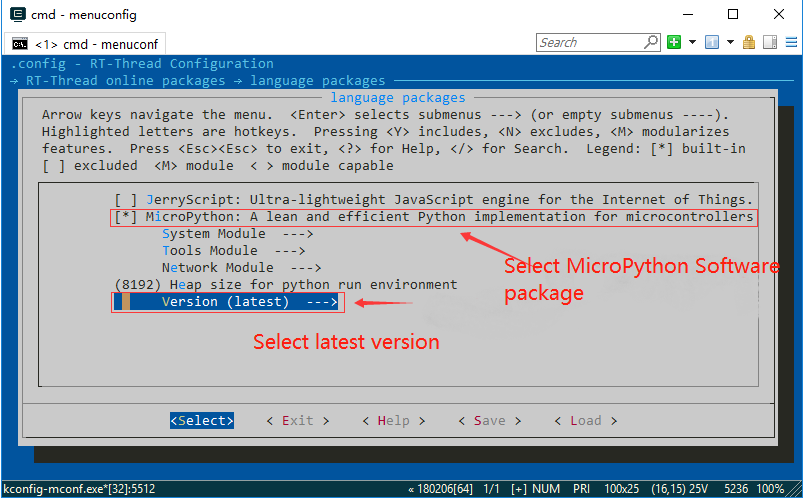

# MicroPython

[中文页](README_ZH.md) | English

## 1. Introduction

This is a port of `MicroPython` on RT-Thread, which can run on **RT-Thread 3.0** or higher. This software package can run `MicroPython` on embedded systems equipped with RT-Thread.

### 1.1 Directory structure

| Name | Description |
| ---- | ---- |
| docs | Document directory, including getting started guide and development manual |
| drivers | MicroPython source code directory |
| extmod | MicroPython Source Code Directory |
| lib | MicroPython source code directory |
| py | MicroPython source code directory |
| port | Porting code directory |
| LICENSE | Micropython MIT License |

### 1.2 License

RT-Thread MicroPython follows the MIT license, see the `LICENSE` file for details.

### 1.3 Dependency

- RT-Thread 3.0+

## 2. How to open RT-Thread MicroPython

To use `MicroPython package`, you need to select it in the RT-Thread package manager. The specific path is as follows:

Then let the RT-Thread package manager automatically update, or use the `pkgs --update` command to update the package to the BSP.

## 3. Use RT-Thread MicroPython

After selecting `MicroPython package`, when compiling `bsp` again, it will be added to the `bsp` project for compilation.

* For quick start, please refer to [this article](https://rt-thread.medium.com/micropython-software-package-2101e3cafc93).
* For the development process, please refer to the [development documents](https://github.com/RT-Thread/mpy-snippets/blob/master/docs/MicroPythonPlug-in/README_EN.md).

## 4. Matters needing attention

- Need to use **RT-Thread 3.0** or above.
- Select the `latest` version of `Micropython` in the `menuconfig` option.

## 5. Development resources

* [RT-Thread MicroPython source code](https://github.com/RT-Thread-packages/micropython)
* [RT-Thread MicroPython Forum](https://www.rt-thread.org/qa/forum.php)
* [MicroPython official website](https://micropython.org/)
* [Official online documentation](http://docs.micropython.org/en/latest/pyboard/)
* [MicroPython Online Demo](https://micropython.org/unicorn)
* [MicroPython source code](https://github.com/micropython/micropython)
* [MicroPython Official Forum](http://forum.micropython.org/)
