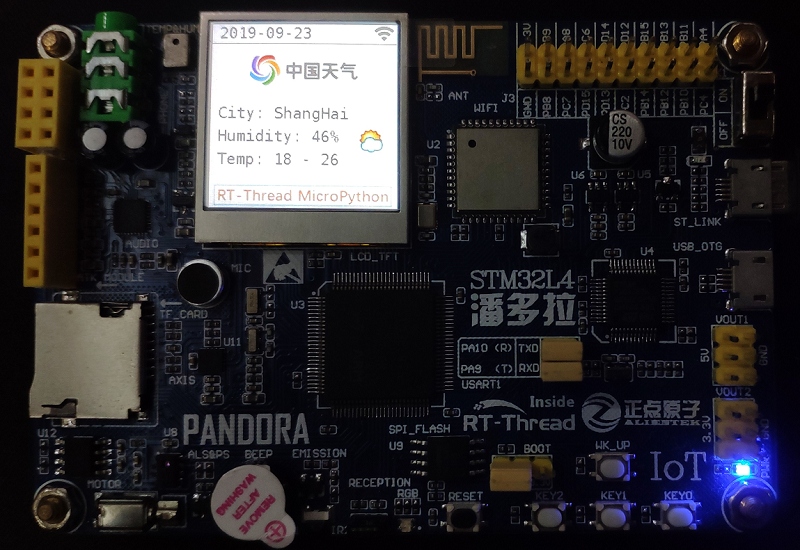
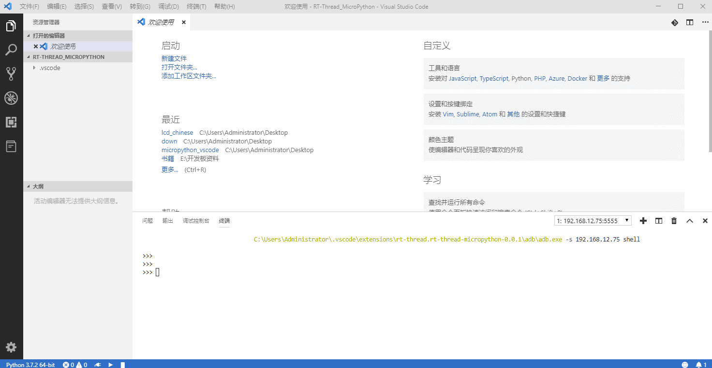
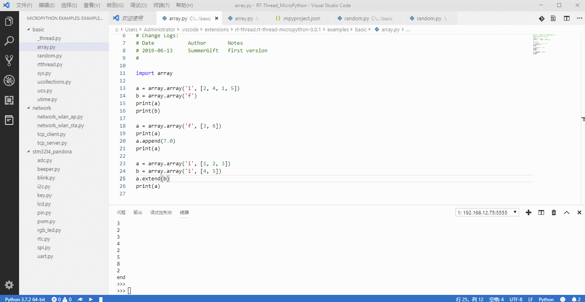
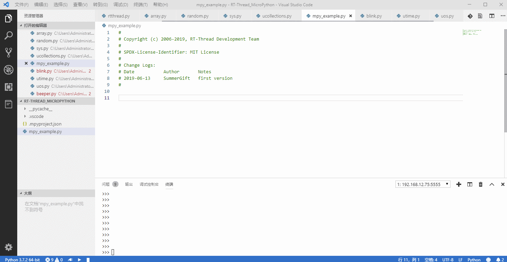

# VSCode 最好用的 MicroPython 插件

VSCode 最好用的 MicroPython 插件，为 MicroPython 开发提供了强大的开发环境，主要特性如下：

- 便捷的开发板连接方式
- 支持基于 MicroPython 的代码智能补全与语法检查
- 支持 MicroPython REPL 交互环境
- 提供丰富的代码示例与 demo 程序
- 支持全工程同步功能
- 支持在设备上运行示例代码文件
- 支持代码片段运行功能
- 支持多款主流 MicroPython 开发板
- 支持 windows 及 ubuntu 操作系统

## 开发板支持列表

| 编号 | 开发板名称                                                   | 固件获取方式                                                 |
| ---- | ------------------------------------------------------------ | ------------------------------------------------------------ |
| 1    | [STM32L4 Pandora IoT Board](https://github.com/RT-Thread/IoT_Board/tree/master/examples/31_micropython) | [RT-Thread 论坛固件汇总贴](https://www.rt-thread.org/qa/forum.php?mod=viewthread&tid=12305&page=1&extra=#pid52954) |
| 2    | [W601 IoT Board](https://github.com/RT-Thread/W601_IoT_Board/tree/master/examples/15_component_micropython) | [RT-Thread 论坛固件汇总贴 ](https://www.rt-thread.org/qa/forum.php?mod=viewthread&tid=12305&page=1&extra=#pid52954) |
| 3    | [ESP8266](https://micropython.org/download#esp8266)          | 点击左侧链接                                                 |
| 4    | [ESP32](https://micropython.org/download#esp32)              | 点击左侧链接                                                 |
| 5    | [PYboard](https://micropython.org/download#pyboard)          | 点击左侧链接                                                 |
| 6    | [others](https://micropython.org/download#other)             | 点击左侧链接                                                 |

`STM32L4 Pandora IoT Board` 与 `W601 IoT Board` 开发板的固件由 RT-Thread 官方提供，同时针对 MicroPython 插件开发环境进行深度优化，提供强大的工程同步功能以及更加丰富的固件功能。

欢迎加入`RT-Thread MicroPython` 交流 QQ 群 **703840633** 获取最新固件，进行技术交流。

## 准备工作

1. 在 windows 操作系统下使用插件需要将 vscode 的默认终端修改为 powershell，如下图所示：

   

如果想要使用 MicroPython 自动补全功能（如果暂时不需要自动补全功能，可以跳过后续步骤），还需要进行如下操作：

2. 安装 Python 插件

3. 按照 Python 插件的提示在 PC 上安装 Python3 并加入到系统环境变量中

如果在 PC 上已经安装过上述插件和程序，可以跳过此准备步骤。

### ubuntu 支持

本插件支持在 **ubuntu 18.04** 版本下运行，为了避免在 ubuntu 系统下频繁获取串口权限，需要将当前用户加入到 `dialout` 用户组中，手动输入如下命令即可，`$USERNAME` 是系统当前用户名：

`sudo usermod -aG dialout $USERNAME`

注意：配置修改后需要 **重启一下操作系统** 使配置生效。

## 快速上手

###  创建 MicroPython 工程

#### 创建一个空白 MicroPython 工程

#### 创建一个基于 demo 的 MicroPython 工程

- `weather show demo` 在 `pandora IoT board` 上的运行效果

该 demo 全部代码使用 MicroPython 编写，可在 `Pandora/W601 IoT Board` 开发板上直接下载运行。

### 连接开发板

### 查看示例代码文件

### 在开发板上下载并运行示例文件

和开发板建立连接后，可以直接运行示例代码，并观察代码在开发板上的运行效果，如下图所示：

### 在开发板上运行 MicroPython 代码片段

### 基于 MicroPython 的代码智能补全

## 开发资源

- [RT-Thread MicroPython 开发用户手册](https://www.rt-thread.org/document/site/submodules/micropython/docs/)
- [RT-Thread MicroPython 软件包](https://github.com/RT-Thread-packages/micropython)
- [RT-Thread MicroPython 示例程序及库](https://github.com/RT-Thread/mpy-snippets)
- [RT-Thread MicroPython 论坛](https://www.rt-thread.org/qa/forum.php?mod=forumdisplay&fid=2&filter=typeid&typeid=20)
- [MicroPython IDE 用户指南](https://www.rt-thread.org/document/site/submodules/micropython/docs/MicroPythonPlug-in/MicroPython_IDE_User_Manual/)
- [MicroPython 固件开发指南](https://www.rt-thread.org/document/site/submodules/micropython/docs/MicroPythonPlug-in/MicroPython_Firmware_Development_Guide/)

## 注意事项

- 不要删除工程目录下的 `.mpyproject.json` 文件，该文件是 MicroPython 工程的配置文件，删除后将无法正常运行 MicroPython 代码程序。

  